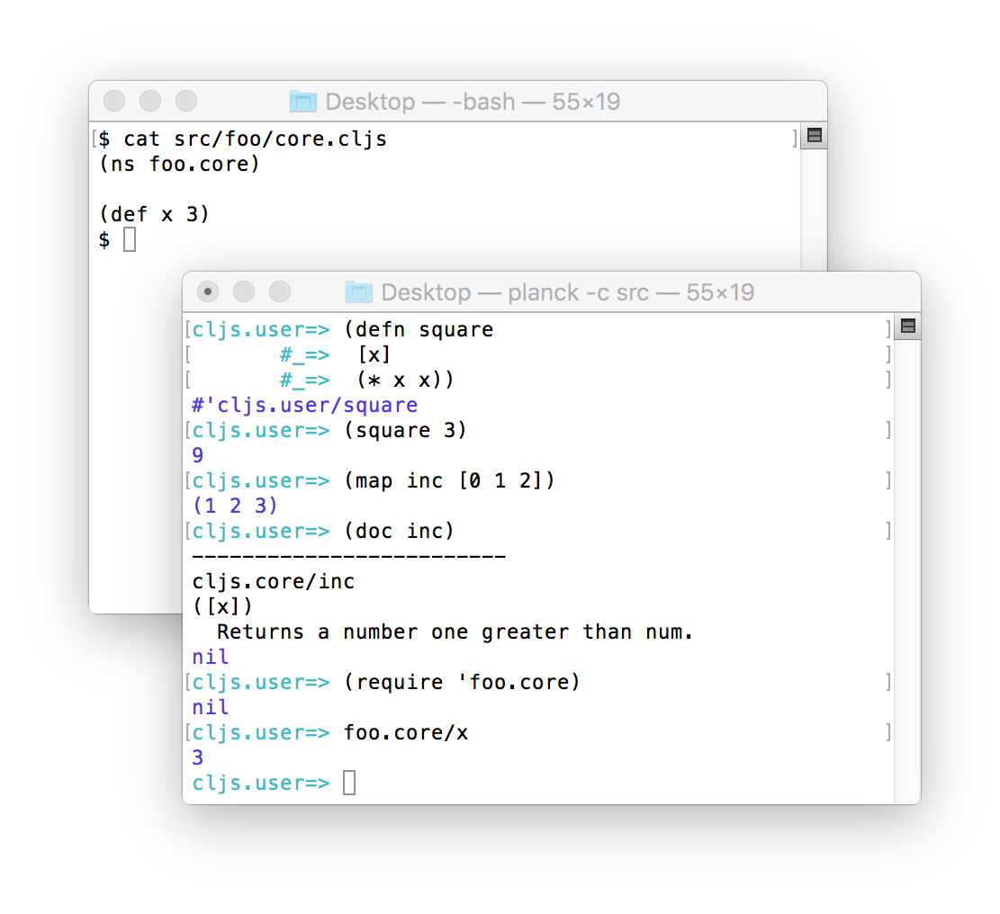

# Planck

Planck is a stand-alone ClojureScript REPL for macOS and Linux.

Planck launches instantly and is useful for scripting.



You can run Clojure-idiomatic scripts with Planck:

```clojure
(require '[planck.core :refer [line-seq with-open]]
         '[planck.io :as io]
         '[planck.shell :as shell])

(with-open [rdr (io/reader "input.txt")]
  (doseq [line (line-seq rdr)]
    (println (count line))))

(shell/sh "say" "done")
```

Get it: On macOS `brew install planck`, on Ubuntu [install](https://cljdoc.org/d/planck/planck/CURRENT/doc/setup) using `apt-get`. Otherwise [download](https://planck-repl.org/binaries/) a binary, or [build](https://github.com/planck-repl/planck#building) it. 

Online docs: [](https://cljdoc.org/d/planck/planck/CURRENT)

Planck is free and [open source](https://github.com/planck-repl/planck).
