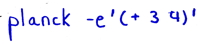

## One Liners


It is possible to use Planck directly on the command line, evaluating forms directly without entering a interactive REPL. To do this, pass `-e` or ` -​-​eval`.

For example, here is a way to calculate π, based on a popular technique used in the early days with BASIC:

```
$ planck -e'(* 4 (Math/atan 1))'
3.141592653589793
```

It is also possible to use multiple evals. This prints a directory listing:

```
planck -e"(require 'planck.core)" -e'(run! (comp println :path) (planck.core/file-seq "/tmp"))'
```
