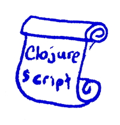

## Scripts


Planck can be used to run scripts written in ClojureScript. Planck and JavaScriptCore are fast to start up, and the ClojureScript reader and compiler have been optimized for bootstrapped mode, making this a perfectly feasible approach. It makes for a great alternative for shell scripts written in, say, Bash.

Perhaps the simplest way to execute a script with Planck is to create a file and to use `plk` or `planck` to run it. For example, say you have `foo.cljs` with

```
(println "Hello World!")
```

Then you can execute it:

```
$ plk foo.cljs
Hello World!
```

### Standalone Scripts

What if you'd like to make a standalone executable? The Clojure reader treats `#!` as a line comment, supporting the use of shebang scripts. You can change `foo.cljs` to look like

```
#!/usr/bin/env plk
(println "Hello World!")
```

and then if you first set the executable bit, you can execute the file directly:

```
$ chmod +x foo.cljs 
$ ./foo.cljs 
Hello World!
```

```
$ plk bar.cljs there
Hello there!
```

> If you'd like to directly specify dependencies in scripts using `#!` see the “Shebang Deps” section of [Dependencies](https://planck-repl.org/dependencies.html).

### Main Function

#### Specifying the Main Namespace

If you'd like your script to start execution by executing a main function, you can make use of Planck's `-m` command-line option, specifying the namespace containing a `-main` function. Let's say you have `foo/core.cljs` with:

```
(ns foo.core)

(defn greet [name]
  (println (str "Hello " name "!")))

(defn -main [name]
  (greet name))
```

then this works:

```
$ plk -m foo.core ClojureScript
Hello ClojureScript!
```

#### Specifying the Main Function

Alternatively, you can make use of `cljs.core/*main-cli-fn*`. If this Var is set to a function, and `-m` hasn't been specified, then the main function will be called.

This can be especially useful for standalone scripts on Linux, where it is not possible to specify interpreter arguments in the shebang line. Consider this alternative to the above, where this file is saved as `foo`:

```
#!/usr/bin/env plk
(ns foo.core)

(defn greet [name]
  (println (str "Hello " name "!")))

(defn -main [name]
  (greet name))
  
(set! *main-cli-fn* -main)
```

Then this works:

```
$ ./foo ClojureScript
Hello ClojureScript!
```

All that needs to be ensured is that the code that `set!`s `*main-cli-fn*` is called, either via a `-e` to require the needed namespace, or by direct execution as in the example above.

### Interacting with standard input and output

When writing scripts, getting input from standard input is quite useful. Clojure
has two dynamic vars, `core/*in*` and `core/*out*`. Whenever you use `println`,
you're actually printing to whatever `core/*out*` is bound to. ClojureScript has
its own `*out*` which lives in `cljs.core`, but it lacks (for obvious reaons)
`*in*`. Planck, though provides `planck.core/*in*` which lets you interact with
standard input.

So in order to demonstrate this, here is a script that simply copies each line
it receives on standard input to standard out:

```
#!/usr/bin/env plk

(ns example.echo
  (:require [planck.core :as core]))

(doseq [l (core/line-seq core/*in*)]
  (println l))
```

### Command Line Arguments

If you'd like to gain access to the command line arguments passed to your script, they are available in `cljs.core/*command-line-args*`.

With `bar.cljs`:

```
(ns bar.core)

(println (str "Hello " (first *command-line-args*) "!"))
```

#### Argument Processing

You can use the [`clojure.tools.cli`](https://github.com/clojure/tools.cli) library to parse command line options. Here is the intro example being used with Planck:

```
$ plk -Sdeps '{:deps {org.clojure/tools.cli {:mvn/version "0.3.5"}}}' -m my.program -vvvp8080 foo --help --invalid-opt
{:options {:port 8080, :verbosity 3, :help true},
 :arguments ["foo"],
 :summary "  -p, --port PORT  80  Port number\n  -v                   Verbosity level\n  -h, --help",
 :errors ["Unknown option: \"--invalid-opt\""]}
```

where `src/my/program.cljs` contains:

```clojure
(ns my.program
  (:require [clojure.tools.cli :refer [parse-opts]]
            [fipp.edn :refer [pprint]]))

(def cli-options
  ;; An option with a required argument
  [["-p" "--port PORT" "Port number"
    :default 80
    :parse-fn #(js/parseInt %)
    :validate [#(< 0 % 0x10000) "Must be a number between 0 and 65536"]]
   ;; A non-idempotent option
   ["-v" nil "Verbosity level"
    :id :verbosity
    :default 0
    :assoc-fn (fn [m k _] (update-in m [k] inc))]
   ;; A boolean option defaulting to nil
   ["-h" "--help"]])

(defn -main [& args]
  (pprint (parse-opts args cli-options)))
```

### Environment Variables

Environment variables are accessible via `planck.environ/env`. For example, the following script will print the `HOME` environment variable:

```
(ns baz.core 
  (:require [planck.environ :refer [env]]))
  
(println (:home env)) 
```

### Shell Interaction

The `planck.shell` namespace provides functions for interacting with the shell.
Commands can be executed by running the `sh` function as seen in the following example:

```
#!/usr/bin/env plk
(ns foo.core
  (:require [planck.shell :refer [sh]]))

(defn list-files [dir]
  (println "listing files in" dir)
  (println (sh "ls" "-l" dir)))

(list-files (first *command-line-args*))
```

### Script Termination Delay

If you run a script that starts a timer, or launches an asynchronous shell interaction, the script will continue running so long as there are pending timers or shell activities.

For example, this script will run for 5 seconds, print "done" and then terminate:

```
(def x (js/setTimeout #(println "hi") 1e6))

(js/setTimeout #(println "done") 5000)

(js/clearTimeout x)
```

Similarly, this script will wait for 3 seconds, print `:done` and terminate:

```
(require '[planck.shell :refer [sh-async]])

(sh-async "sleep" "3" #(prn :done))
```


